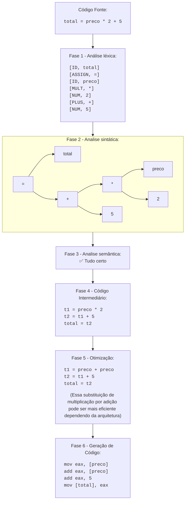

**A1 (8 pts).** Explique, com suas palavras e um exemplo próprio, a diferença entre
um **sistema gerador** e um **sistema reconhecedor** de linguagens. Dê uma gramática
e o esboço de um reconhecedor para a *mesma* linguagem.

**R:** A diferença principal é que enquanto o sistema gerador é aquele que gera as cadeias de uma linguagem, o sistema reconhecedor apenas decide se essa cadeia é valida para a linguagem específica ou não.

Por exemplo, na linguagem: $L = \lbrace x^ny^{2n} \mid n \ge 0 \rbrace$

Um gerador dessa linguagem poderia ser  definido como:
\
$S \rightarrow xSyy \\ S \rightarrow \epsilon$

E então um reconhecedor iria adicionar cada $x$ a uma pilha e a cada 2 símbolos $y$ remover um $x$ da pilha. O reconhecedor precisaria garantir que a pilha fique vazia no final e também garantir que não há nenhum outro simbolo $y$ assim que a pilha fique vazia, caso contrario o reconhecedor iria rejeitar a cadeia.

---

**A2 (8 pts).** Para cada linguagem, indique o recurso mínimo de memória do
reconhecedor (*nenhum além do estado* / *pilha* / *memória ilimitada*) e **justifique
em uma frase**:

| # | Linguagem sobre `Σ = {a, b}` |
|---|---|
| a | cadeias que começam com `a` |
| b | cadeias com número igual de `a`s e `b`s |
| c | cadeias de tamanho múltiplo de 3 |
| d | palíndromos |
| e | `{ aⁿbⁿcⁿ \| n ≥ 1 }` |

**R:**
|#|Resposta|Justificativa|
|---|---|---|
|a|Nenhum além do estado|Só é preciso ler o primeiro símbolo da cadeia e garantir que ele seja um `a`.|
|b|Pilha|A pilha pode ser usada para garantir que a quantidade símbolos `a` e `b` é igual, mesmo em uma linguagem em que os símbolos podem estar em qualquer ordem, a pilha ainda pode ser usada para controlar a diferença entre a quantidade de cada símbolo.|
|c|Nenhum além do estado|Só é preciso manter três estados que representam o comprimento da cadeia módulo 3.|
|d|Pilha|A pilha empilha a primeira metade dos símbolos e então na segunda metade começa a desempilhar para comparar igualdade.|
|e|Memória ilimitada|Uma única pilha não é capaz de de lidar com quantidades arbitrárias três ou mais símbolos distintos: "Você empilha nos a, desempilha nos b... e nos c, desempilha o quê? A pilha já está vazia."|

---

**A3 (8 pts).** Desenhe (ASCII ou imagem) o pipeline de compilação para a instrução
abaixo, mostrando a saída de **cada uma das 6 fases** vistas em aula:

```c
total = preco * 2 + 5;
```

**R:**



---

**A4 (8 pts).** Uma equipe quer suportar 4 linguagens-fonte em 5 arquiteturas.
Quantos tradutores completos são necessários **com** e **sem** uma representação
intermediária? Explique por que o LLVM adota a segunda estratégia.

**R:** Sem uma linguagem intermediária, são necessários 20 tradutores ($4\times5=20$) já que cada combinação de linguagem e arquitetura precisaria de um tradutor individual. Já no caso em que a equipe usa uma linguagem intermediária, será preciso apenas 9 tradutores ($4+5=9$), quatro para cada transição de linguagem fonte para intermediária e cinco para cada transição de linguagem intermediária para arquitetura. Assim fica claro o motivo da ferramenta LLVM adotar a segunda estratégia, pois ela simplifica a quantidade de tradutores a serem desenvolvidos.

---

**A5 (8 pts).** Classifique cada ferramenta como *compilador*, *interpretador* ou
*híbrido*, justificando: `gcc`, `CPython`, `javac` + JVM, `tsc` (TypeScript),
V8 (JavaScript), `rustc`.

**R:**
| Ferramenta | Classificação | Justificativa |
|---|---|---|
gcc|Compilador|Compila código C/C++ diretamente para código de máquina.|
CPython|Híbrido|Compila código Python para uma linguagem de bytecode (.pyc) e depois interpreta o bytecode.|
javac + JVM|Híbrido|Compila código Java para uma linguagem de bytecode (.class) e depois interpreta o bytecode, o JVM moderno também pode usar compilação JIT.|
tsc (TypeScript)|Compilador|Compila código TypeScript para JavaScript, não interpreta TypeScript diretamente.|
V8 (JavaScript)|Híbrido|Dividido em duas partes, o interpretador "Ignition" e o compilador JIT "TurboFan". |
rustc|Compilador|Compila código Rust diretamente para código de máquina.|

---

**B1 (10 pts).** Tokenize o programa abaixo no formato `<TIPO, lexema>`, uma linha
por token, descartando espaços e comentários:

```c
// calcula desconto
while (qtd <= 100) {
    preco = preco - 0.5;
    qtd = qtd + 1;
}
```

**R:**
```
<WHILE, while> 
<LPAREN, (> 
<ID, qtd> 
<LE, <=> 
<NUM, 100> 
<RPAREN, )> 
<LBRACE, {> 
<ID, preco>
<ASSIGN, =>
<ID, preco> 
<SUB, -> 
<NUM, 0.5> 
<SEMI, ;> 
<ID, qtd> 
<ASSIGN, => 
<ID, qtd> 
<PLUS, +> 
<NUM, 1> 
<SEMI, ;> 
<RBRACE, }>
```

---

**B2 (5 pts).** Qual o problema de tokenizar `a<=-1` sem a regra do **maior
casamento possível** (*longest match*)? Mostre as duas tokenizações possíveis.

**R:** O problema é que não usar a regra cria uma ambiguidade pois `<=` é um token que contém dois caracteres que podem ser considerados tokens individualmente, sendo eles `<` e `=`. As duas tokenizações possíveis caso a regra não seja seguida são:
```
<ID, a>
<LE, <=>
<SUB, ->
<NUM, 1>
```
```
<ID, a>
<LESSER, <>
<ASSIGN, =>
<SUB, ->
<NUM, 1>
```
A segunda tokenização também é sintaticamente inválida pois a grande maioria das linguagens não suportam esse tipo de uso de operadores.

---

**B3 (5 pts).** O scanner consegue detectar o erro em `x = = 5;`? E em
`y = z + 1;` onde `z` nunca foi declarado? Explique **qual fase** pega cada erro.

**R:** O scanner léxico na maioria dos casos apenas garante que um código tem tokens válidos e então ele não detecta o erro na maioria dos casos. O primeiro caso `x = = 5;` normalmente é detectado na fase de análise sintatica pois o compilador irá falhar em formar uma estrutura válida para o programa. Já no segundo caso `y = z + 1;` o erro tende a acontecer na fase análise semântica onde esses tipos de erros são checados.

---

D1. Explique por que a linguagem "cadeias w que são programas Python que terminam sua execução" não pode ser reconhecida por nenhum programa — mesmo com memória infinita. Não precisa de prova formal; construa um argumento por contradição em ~10 linhas. (Voltaremos a isso na Aula 23.)

**R:** A parte problemática está em "que terminam sua execução", pois não é possível criar um programa que determine se outro programa Python termina sua execução. Para justificar essa afirmação será criado a função hipotética $f(w)$, essa função terá o valor $f(w) = 1$ se $w$ for um programa que termine e $f(w) = 0$ caso contrário, por fim será criado um programa python $g(w)$, esse program também recebe uma cadeia $w$ e fará o seguinte:
- Executará a função $f(w)$.
- Caso $f(w) = 1$ o programa entrará em um loop infinito e nunca terminará.
- Caso $f(w) = 0$ o programa terminará sua execução.

E por fim executaremos o programa com sua própria cadeia como entrada $g(g)$, internamente o programa irá avaliar a função $f(g)$ e então a seguinte contradição será criada:
- Caso $f(g) = 1$ o programa não irá terminar, contradizendo o próprio resultado de $f$.
- Caso $f(g) = 0$ o programa irá terminar, também contradizendo o resultado de $f$.
Isso significa que é impossível que um programa implemente $f(x)$, confirmando o enunciado inicial que nenhum programa mesmo com memória infinita pode reconhecer a linguagem "cadeias w que são programas Python que terminam sua execução".